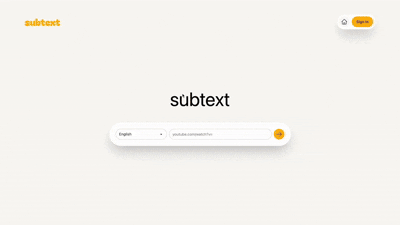
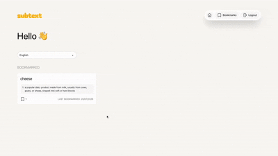

# subtext

An AI-powered platform that enables users to learn languages interactively through their favourite Youtube videos. 

Powered by intelligent, contextual explanations of subtitles, users not only learn unfamiliar phrases but also the cultural nuances that are often lost in direct translations, which transforms passive video watching into an immersive language-learning experience.

### Tech-Stack
- 💻 Languages: Typescript, Python
- ⚙️ Frameworks: ReactJS, FastAPI, TanStack (React Query), GeminiAPI
- 🛠️ Database: Supabase

### Features

**Following Along with the Transcript**  
Users can enter their favourite Youtube video, and follow along with the transcript. 

**Selecting Words to Learn**  
Users click onto unfamiliar words to get an intelligent explanation powered by AI. Users who are logged in can bookmark their favourites to review later.

<!--  -->

**Reviewing Words**  
Users who have an account can review their bookmarked words and their explanations. Users can find all instances they have bookmarked the same word from different videos in a single interface. Users can also revisit that same moment in the video where the word appears. 

### Build
Further instructions comming soon.
